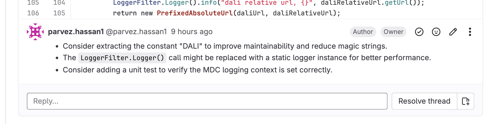
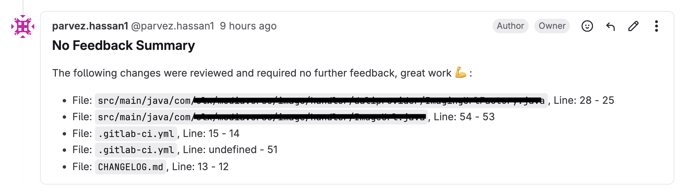

# @parvez3019/ai-code-review-gitlab-plugin

Based on - https://github.com/hataiit9x/gemini-review-code

[](https://opensource.org/licenses/MIT)

## Summary

`@parvez3019/ai-code-review-gitlab-plugin` It is a small tool used for inline code review in GitLab Merge Requests. It supports calling the GitLab API for adding inline review comments and uses either Gemini AI API or AWS Bedrock to obtain AI code review feedbacks. Please note that when using it, ensure compliance with company regulations. 😉


## Features

- 🛠️ Support configuration GitLab API address.
- ⚙️ Support configuration AWS Bedrock (Claude or any bedrock models) for code review.
- 📦 Support configuration GitLab Project ID & Merge Request IID.
- 🚀 Support running in Gitlab CI/CD Pipeline.
- 🚦 Automatically wait and try again when the rate limit is exceeded.
- 💬 The review results are appended to the location of the corresponding code block in the form of comments.
- 🔒 Secure handling of AWS credentials and GitLab tokens.
- 🏷️ Easy integration with GitLab CI/CD pipelines.
- 📝 Provide Summary Sections for the changes where no feedback is required.
- 📝 Customizable prompts via local files or S3


## Screenshots for comments on Gitlab Merge Requests

Review Comment:



Summary Comment For No Feedback Section -



## Install

```sh
npm i @parvez3019/ai-code-review-gitlab-plugin
```

## Environment Variables

### AWS Bedrock Configuration
```bash
# Required for AWS Bedrock
export AWS_REGION="us-east-1"
export AWS_SECRET_ACCESS_KEY="your-aws-secret-key"
export AWS_ACCESS_KEY_ID="your-aws-access-key"
# Available Claude models in Bedrock:
# - anthropic.claude-3-5-sonnet-20241022-v2:0
export AWS_BEDROCK_MODEL="anthropic.claude-3-5-sonnet-20241022-v2:0"
```

### Gemini Configuration
```bash
# Required for Gemini
export GEMINI_API_KEY="your-gemini-api-key"
export GEMINI_API_URL="https://generativelanguage.googleapis.com"
export GEMINI_MODEL="gemini-1.5-flash"
```

### General Configuration
```bash
# Optional: Set default AI provider
export AI_PROVIDER="bedrock"  # or "gemini"
```

## Usage

### Command Line Arguments

```bash
ai-code-review-gitlab-plugin \
  --gitlab-api-url "https://gitlab.com/api/v4" \
  --gitlab-access-token "your-gitlab-token" \
  --project-id 123 \
  --merge-request-id 456 \
  --ai-provider bedrock \  # or gemini
  --api-key "your-api-key" \
  --api-secret "your-api-secret" \  # required for bedrock
  --region "us-east-1" \  # for bedrock
  --custom-model "model-id" \  # optional
  --system-prompt-path "/path/to/system-prompt.txt" \  # optional, local file or s3://bucket/key
  --code-review-prompt-path "/path/to/code-review-prompt.txt" \  # optional, local file or s3://bucket/key
  --s3-region "us-east-1" \  # optional, for S3 prompt paths
  --s3-access-key "your-s3-access-key" \  # optional, for S3 prompt paths
  --s3-secret-key "your-s3-secret-key"  # optional, for S3 prompt paths
```

### GitLab CI/CD Integration

Add the following to your `.gitlab-ci.yml` file to enable automated code reviews:

```yaml
code-review:
  stage: code-review
  image: node:20
  script:
    - npm i -g @parvez3019/ai-code-review-gitlab-plugin
    - |
      if [ "$AI_PROVIDER" = "bedrock" ]; then
        ai-code-review-gitlab-plugin \
          -t "$CODE_REVIEW_GITLAB_TOKEN" \
          -p "$CI_MERGE_REQUEST_PROJECT_ID" \
          -m "$CI_MERGE_REQUEST_IID" \
          -a $AI_PROVIDER \
          -k "$AWS_ACCESS_KEY_ID" \
          -s "$AWS_SECRET_ACCESS_KEY" \
          -r "$AWS_REGION" \
          -c "$AWS_BEDROCK_MODEL" \
          -sp "$SYSTEM_PROMPT_PATH" \
          -crp "$CODE_REVIEW_PROMPT_PATH" \
          --s3-region "$S3_REGION" \
          --s3-access-key "$S3_ACCESS_KEY" \
          --s3-secret-key "$S3_SECRET_KEY"
      else
        ai-code-review-gitlab-plugin \
          -t "$CODE_REVIEW_GITLAB_TOKEN" \
          -p "$CI_MERGE_REQUEST_PROJECT_ID" \
          -m "$CI_MERGE_REQUEST_IID" \
          -a $AI_PROVIDER \
          -k "$GEMINI_API_KEY" \
          -c "$GEMINI_MODEL" \
          -sp "$SYSTEM_PROMPT_PATH" \
          -crp "$CODE_REVIEW_PROMPT_PATH" \
          --s3-region "$S3_REGION" \
          --s3-access-key "$S3_ACCESS_KEY" \
          --s3-secret-key "$S3_SECRET_KEY"
      fi
  only:
    - merge_requests
  when: manual
  tags:
    - build
    - stg
```

### Alternative Trigger Methods

#### 1. Using GitLab Webhooks

You can set up automatic code reviews when you are added as a reviewer using GitLab Webhooks:

1. Go to your GitLab project settings
2. Navigate to Webhooks
3. Add a new webhook with the following settings:
   - URL: Your webhook endpoint (e.g., AWS Lambda function URL)
   - Trigger: Select "Merge request events"
   - Secret token: Generate a secure token

4. Create a webhook handler (example using AWS Lambda):

```javascript
exports.handler = async (event) => {
    const payload = JSON.parse(event.body);
    
    // Check if this is a merge request event
    if (payload.object_kind === 'merge_request') {
        // Check if the action is adding a reviewer
        if (payload.action === 'reviewer') {
            // Check if you are the added reviewer
            const yourGitlabId = 'YOUR_GITLAB_USER_ID';
            const addedReviewers = payload.changes.reviewers?.current || [];
            
            if (addedReviewers.some(reviewer => reviewer.id === yourGitlabId)) {
                // Trigger the code review
                const response = await fetch('https://gitlab.com/api/v4/projects/' + 
                    payload.project.id + '/merge_requests/' + 
                    payload.object_attributes.iid + '/pipeline', {
                    method: 'POST',
                    headers: {
                        'PRIVATE-TOKEN': process.env.GITLAB_TOKEN
                    }
                });
            }
        }
    }
    
    return {
        statusCode: 200,
        body: JSON.stringify('Webhook processed')
    };
};
```

This setup will:
1. Listen for merge request events
2. Check if you are added as a reviewer
3. Automatically trigger the code review pipeline when you are added

Make sure to:
- Replace `YOUR_GITLAB_USER_ID` with your actual GitLab user ID
- Set up the necessary environment variables in your webhook handler
- Configure proper security measures for your webhook endpoint

#### 2. Using GitLab API Directly

You can also trigger the code review directly using the GitLab API:

```bash
curl --request POST \
  --header "PRIVATE-TOKEN: $GITLAB_TOKEN" \
  "https://gitlab.com/api/v4/projects/$PROJECT_ID/merge_requests/$MR_IID/pipeline"
```

This can be integrated into your existing workflows or automation scripts.

### Options

| Option | Description | Default | Required |
|--------|-------------|---------|----------|
| `-g, --gitlab-api-url` | GitLab API URL | https://gitlab.com/api/v4 | No |
| `-t, --gitlab-access-token` | GitLab Access Token | - | Yes |
| `-p, --project-id` | GitLab Project ID | - | Yes |
| `-m, --merge-request-id` | GitLab Merge Request ID | - | Yes |
| `-a, --ai-provider` | AI Provider (gemini or bedrock) | gemini | No |
| `-k, --api-key` | API Key (Gemini API Key or AWS Access Key ID) | - | Yes |
| `-s, --api-secret` | API Secret (AWS Secret Access Key for Bedrock) | - | Yes (for bedrock) |
| `-r, --region` | AWS Region for Bedrock | us-east-1 | No |
| `-c, --custom-model` | Custom Model ID | - | No |
| `-sp, --system-prompt-path` | System Prompt Path | - | No |
| `-crp, --code-review-prompt-path` | Code Review Prompt Path | - | No |
| `-sr, --s3-region` | S3 Region | - | No |
| `-sk, --s3-access-key` | S3 Access Key | - | No |
| `-ssk, --s3-secret-key` | S3 Secret Key | - | No |

## Troubleshooting

### AWS Bedrock Issues

1. **Model Not Available Error**
   - Make sure you're using a supported model ID
   - Check if you have access to the model in your AWS region
   - Verify that your AWS account has the necessary permissions

2. **Authentication Errors**
   - Verify your AWS credentials are correct
   - Check if your AWS credentials have the necessary permissions for Bedrock
   - Ensure your AWS region is correct

3. **Rate Limiting**
   - The tool will automatically retry when rate limited
   - Consider using a different model if you're consistently hitting rate limits

### Gemini Issues

1. **API Key Issues**
   - Verify your Gemini API key is correct
   - Check if your API key has the necessary permissions
   - Ensure you're using the correct API URL

2. **Model Availability**
   - Make sure you're using a supported model ID
   - Check if your API key has access to the specified model

## Requirements

- Node.js >= 20.0.0
- GitLab account with API access
- Google Cloud account (for Gemini) or AWS account (for Bedrock)

## Contributing

Welcome to contribute code, ask questions and suggestions! 👏

## License

This project is based on the MIT license. See the LICENSE file for details. 📜