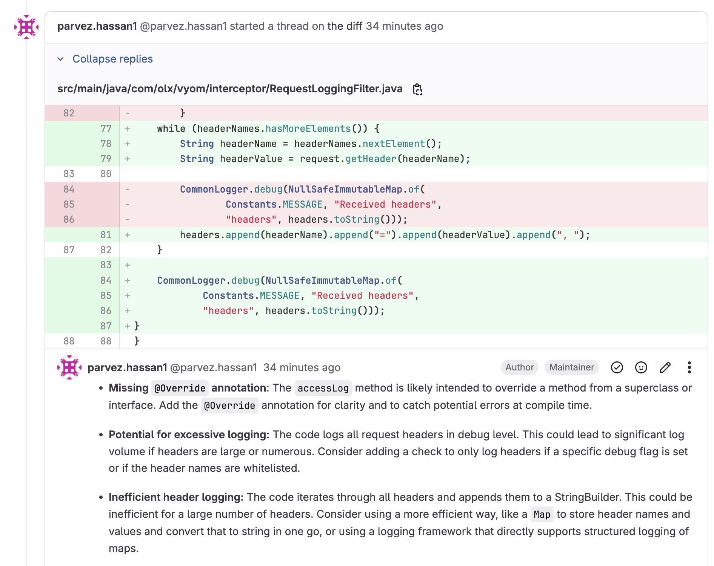

# @parvez3019/gemini-review-code

Based on - https://github.com/hataiit9x/gemini-review-code

[](https://opensource.org/licenses/MIT)

## Summary



`@parvez3019/gemini-review-code` It is a small tool used for code review in GitLab Merge Requests. It supports calling the GitLab API for private 
deployment and uses either Gemini AI API or AWS Bedrock (Claude) to obtain review results. Please note that when using it, ensure compliance with company regulations. 😉


## Features

- 🛠️ Support configuration GitLab API address
- ⚙️ Support configuration Gemini API Key to implement load balancing of interface calls (multiple Keys are separated by commas)
- 📦 Support configuration Gemini custom model ID
- 📦 Support configuration GitLab Project ID
- 📦 Support configuration GitLab Merge Request ID
- 🚀 Support running in CI/CD
- 🚦 Automatically wait and try again when the rate limit is exceeded
- 💬 The review results are appended to the location of the corresponding code block in the form of comments
- 🤖 Support for both Gemini and AWS Bedrock (Claude) models


## Install

```sh
npm i @parvez3019/gemini-review-code
```

## Environment Variables

### AWS Bedrock Configuration
```bash
# Required for AWS Bedrock
export AWS_ACCESS_KEY_ID="your-aws-access-key"
export AWS_SECRET_ACCESS_KEY="your-aws-secret-key"
export AWS_REGION="us-east-1"
# Available Claude models in Bedrock:
# - anthropic.claude-3-5-sonnet-20241022-v2:0
export AWS_BEDROCK_MODEL="anthropic.claude-3-5-sonnet-20241022-v2:0"
```

### Gemini Configuration
```bash
# Required for Gemini
export GEMINI_API_KEY="your-gemini-api-key"
export GEMINI_API_URL="https://generativelanguage.googleapis.com"
export GEMINI_MODEL="gemini-1.5-flash"
```

### General Configuration
```bash
# Optional: Set default AI provider
export AI_PROVIDER="bedrock"  # or "gemini"
```

## Usage

### Command Line Arguments

```bash
gemini-review-code \
  --gitlab-api-url "https://gitlab.com/api/v4" \
  --gitlab-access-token "your-gitlab-token" \
  --project-id 123 \
  --merge-request-id 456 \
  --ai-provider bedrock \  # or gemini
  --api-key "your-api-key" \
  --api-secret "your-api-secret" \  # required for bedrock
  --region "us-east-1" \  # for bedrock
  --custom-model "model-id"  # optional
```

### Options

| Option | Description | Default | Required |
|--------|-------------|---------|----------|
| `-g, --gitlab-api-url` | GitLab API URL | https://gitlab.com/api/v4 | No |
| `-t, --gitlab-access-token` | GitLab Access Token | - | Yes |
| `-p, --project-id` | GitLab Project ID | - | Yes |
| `-m, --merge-request-id` | GitLab Merge Request ID | - | Yes |
| `-a, --ai-provider` | AI Provider (gemini or bedrock) | gemini | No |
| `-k, --api-key` | API Key (Gemini API Key or AWS Access Key ID) | - | Yes |
| `-s, --api-secret` | API Secret (AWS Secret Access Key for Bedrock) | - | Yes (for bedrock) |
| `-r, --region` | AWS Region for Bedrock | us-east-1 | No |
| `-c, --custom-model` | Custom Model ID | - | No |

## Troubleshooting

### AWS Bedrock Issues

1. **Model Not Available Error**
   - Make sure you're using a supported model ID
   - Check if you have access to the model in your AWS region
   - Verify that your AWS account has the necessary permissions

2. **Authentication Errors**
   - Verify your AWS credentials are correct
   - Check if your AWS credentials have the necessary permissions for Bedrock
   - Ensure your AWS region is correct

3. **Rate Limiting**
   - The tool will automatically retry when rate limited
   - Consider using a different model if you're consistently hitting rate limits

### Gemini Issues

1. **API Key Issues**
   - Verify your Gemini API key is correct
   - Check if your API key has the necessary permissions
   - Ensure you're using the correct API URL

2. **Model Availability**
   - Make sure you're using a supported model ID
   - Check if your API key has access to the specified model

## Requirements

- Node.js >= 18.0.0
- GitLab account with API access
- Google Cloud account (for Gemini) or AWS account (for Bedrock)

## Contributing

Welcome to contribute code, ask questions and suggestions! 👏

## License

This project is based on the MIT license. See the LICENSE file for details. 📜